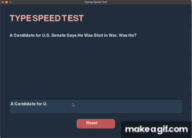

# Typing Speed Test Game

A Python-based Typing Speed Test application that fetches random titles from the New York Times using their **Top Stories API**. This app measures your typing speed, accuracy, and words per minute (WPM) in a fun and interactive way. 

## **Demo**



---

## **Features**

- **Interactive Typing Test:** Measure your WPM and typing accuracy in real-time.
- **Dynamic Content:** Sentences are fetched from the New York Times Top Stories API.
- **Reset Functionality:** Start a new session with one click after completing a test.

---

## **Prerequisites**

Make sure you have the following installed:

- **Python 3.x**
---

## **Project Setup**

### **1. Clone the Repository via SSH**

Clone the repository using SSH:

```bash
git clone git@github.com:DerickW126/Typing-Game-Project.git
cd Typing-Game-Project
```

### **2. Install Dependencies**

Install the necessary dependencies using `requirements.txt`:

```bash
pip install -r requirements.txt
```
### **3. Set Up Your API Key**

1. **Create a `.env` file** in the project root directory:
```bash
NYT_API_KEY=your_nyt_api_key_here
```
2. **Get your API key** from the [NYT Developer Portal](https://developer.nytimes.com/).

3. **Ensure the `.env` file is ignored by Git** to keep it secure. If you don't have a `.gitignore` file yet, create one and add the following line:
```bash
.env
```

### **4. Run the Application

Once your API key is set up and dependencies are installed, you can run the application:

```bash
python pp.py
```
